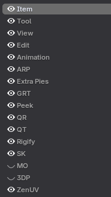
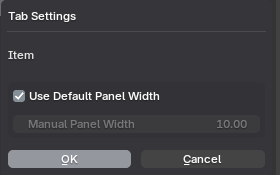
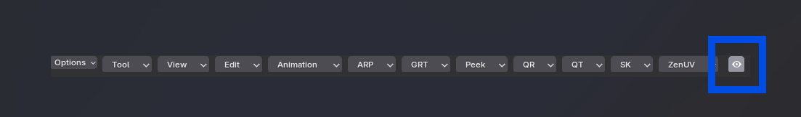

# Documentation

## Preferences

You can tweak preferences for Horizontal Tabs in the preferences menu.

1.  Navigate to **Edit** > **Preferences** > **Add-ons**.
2.  Search for **Horizontal Tabs**.
3.  Expand the add-on to find all settings related to it.
4.  Scroll down to see all your sidebar panels and per-editor settings.

## Operators

### Visibility Toggle
The eye icon located on the left side of the entries allows you to toggle the visibility of add-ons on or off.

### Reordering Tabs
The arrow operators next to the entries list allow you to move entries left or right in the header.

*   **Up Arrow**: Move Left
*   **Down Arrow**: Move Right

## Tab Settings Context Menu

Click the small arrow to open the Tab Settings context menu. These settings will be changed per panel.

*   **Use Default Panel Width**: Uncheck this to override the width manually as needed.

## Editor Visibility Toggle

The global visibility toggle icon is the eye icon located on the left side of the Horizontal Tabs entries.

*   **On (default)**: Shows the header entries for the add-on.
*   **Off**: Hides panel entries from the current editor.

